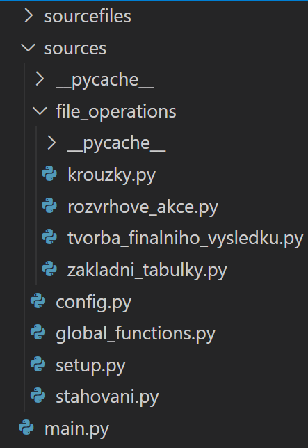

# Základní popis

Aplikace slouží k vygenerováním podkladů pro tvorbu rozvrhu na Univerzitě Jana Evangelisty Purkyně v Ústí nad Labem (dále jen UJEP). Pomocí jednoduchého webového rozhraní může uživatel získat výstupní soubor se seznamem rozvrhovývh akcí pro zvolenou katedru, semestr a rok. 

# Jak začít

Ke spuštění aplikace je pro koncové uživatele nutné vytvořit soubor podklady_rozvrhu.exe pomocí PyInstaller. 
Alternativně lze vytvořit Docker soubor nebo manuálně připravit prostředí - v takovém případě se aplikace spouští příkazem `streamlit run main.py`

POZOR: Pro fungování aplikace je nutný soubor se seznamem kroužků, který je s ohledem na obsah soukromých dat dodáván pouze kvalifikovaným osobám členy rozvrhové komise UJEP.

# Obecná struktura
Tato aplikace je vyvinutá pouze v jazyce Python a funguje jen na straně klienta. Veškerá funkcionalita pro komunikaci s API IS STAG existuje pouze pro získání souborů, které jsou dále zpracovány lokálně. Před vysvětlením kódu je nutné brát v potaz, že k jeho funkci jsou potřeba mimo kódu dva tabulkové soubory. První je seznam kroužků, který je vytvářen členem rozvrhové komise. Druhým je nevyplněný vzorový soubor pro individuální zvolení kapacit pro předměty. Oba dva tyto soubory jsou dodávány společně s aplikací.

V adresáři aplikace je nejprve modul main.py, který inicializuje aplikaci a zároveň obsahuje implementaci Streamlitu. Tato knihovna  zprostředkovává webové rozhraní, skrze které uživatel interaguje s aplikací. 

Zároveň modul zahrnuje implementaci obnovování seznamu předmětů podle akademického roku. Využívá k tomu několik funkcí z ostatních modulů popsaných níže. Obecný postup tohoto procesu lze vidět na Obr. \ref{fig:Diagram_tvorby_seznamu_predmetu_na_rok}.

Mimo tohoto bloku kódu modul zprostředkovává vstupy uživatele v podobě textových polí, rozbalovacích nabídek a polí k nahrání souborů. Uživatel potom spouští program a stahuje soubory prostřednictvím tlačítek.

Na konci kódu a ve spodní části aplikace je poté implementace zobrazení výsledného podkladu k tvorbě rozvrhů v podobě tabulky přímo na stránce. Stejně jako samotný výstupní soubor má tabulka stejné listy mezi kterými lze přepínat. Avšak je zde nutné zmínit, že kvůli přehlednosti je tato tabulka omezená, tzn. nezobrazuje všechny sloupce, a je proto určená pouze jako náhled.

Struktura aplikace se dělí na dva podadresáře. Prvním je \textbf{sourcefiles}, který obsahuje veškeré soubory se kterými aplikace pracuje. nejpodstatnější jsou soubory ve formátu "slozenyVysledek[ROK].xlsx", které obsahují seznam všech platných předmětů pro daný akademický rok. Tento soubor slouží jako startovní bod pro tvorbu podkladů rozvrhu. Dále je jeho součástí soubor "krouzky.xlsx", což je předem zmíněný seznam kroužků. 

Součástí je i několik podadresářů které obsahují výsledky funkcí v modulu "stahovani.py", popsaném níže.

Druhým podadresářem je \textbf{sources}, který nejprve obsahuje několik menších modulů:

## config.py: 
obsahuje nastavení defaultních hodnot ve webovém rozhraní, zvolení některých proměnných použitých pro nastavení běhu programu a strukturu adresářů

## global_functions.py: 
Zahrnuje několik jednoduchých funkcí použitých napříč aplikací. Patří sem například převedení stringu "Prezenční" na "PS" prostřednictvím funkce "prepis\_formu"

## setup.py: 
Velmi krátký modul který pomocí dat v config.py vytváří adresářovou strukturu.

## stahovani.py: 
Zajišťuje veškeré stahování dat z IS STAG. Zahrnuje jednotlivé funkce pro volání specifických webových služeb, které po vytvoření vstupních dat volají funkci "save\_csv". Ta pak využívá knihovnu requests pro komunikaci s IS STAG. 

